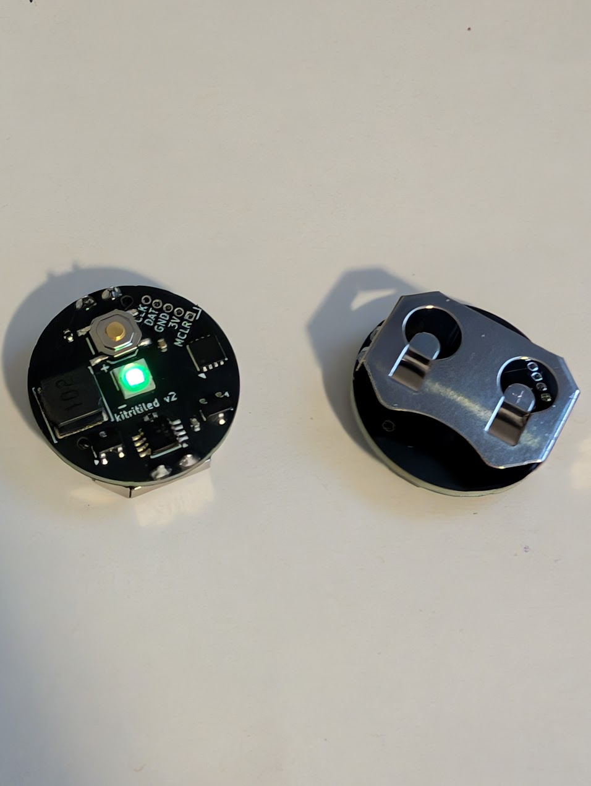

# kitritiled
This is a copy of Ted Yapo's tritiled project from https://github.com/tedyapo/tritiled. It is based on the V3.1 design.
I did my best to reproduce the schematic, and optimize it for automated assembly as opposed to hand-assembly. As a result, it uses some slightly different parts, such as 0402 components when possible.

## Firmware
kitritiled.hex is the firmware to flash. I lost track of the changes I made to the original firmware by Ted - if you use his v30 runtime selectable, it almost works, except the button doesn't seem to trigger the interrupt. It's been a few years since I looked at it, so I pulled the firmware off one of my v1 devices and
that's all I have unfortunately. `modes.h` is also changed slightly from his.

## Flashing
I use MPLAB IPE to flash the firmware with a MPLAB PICkit 5.

## Usage
The device has 10 power levels, and starts on the brightest setting.

When you first insert the battery, you have a 10 second window during which you can configure the power level.

This is done by pushing the button on the device. Once you hit the lowest power level, it will start back at the highest.

When you are done, leave it alone. It will blink the LED to indicate the power level. eg 1 blink for level 1, 2 blinks for level 2, etc.

It will do this three times, at which point it will then lock in at that power level and the button will no longer work.

If you want to change the power level, you need to remove the battery, and wait for the light to go out completely before repeating the above process.